# Confidence Scorer

A terminal-based research agent that takes a question, gathers evidence from the web and academic papers, and produces a confidence score for each factual claim it finds. Built with LangGraph and a local LLM.

## What this does

1. You ask a research question from the command line.
2. The agent searches the web (DuckDuckGo, Tavily, Brave, Google, or Bing) and arXiv for relevant sources.
3. It extracts factual claims from those sources using an LLM.
4. It deduplicates claims into a small set of canonical assertions.
5. For each claim, it classifies every source as supporting, contradicting, or neutral.
6. It computes a confidence score using Bayesian inference (Laplace's Rule of Succession).
7. It prints a colour-coded report showing each claim, its confidence, and the evidence behind it.

## Agent flow

```mermaid
%%{init: {'theme': 'base', 'themeVariables': {'primaryColor': '#E8F4FD', 'primaryTextColor': '#1a1a2e', 'primaryBorderColor': '#5B9BD5', 'lineColor': '#5B9BD5', 'secondaryColor': '#FFF3E0', 'tertiaryColor': '#E8F5E9'}}}%%
flowchart TD
    Q([" User Query "]):::input

    subgraph input_node [" input_node — Validate & Initialize "]
        I1["Parse and validate query"]
        I2["Create HumanMessage"]
        I1 --> I2
    end

    subgraph agent_node [" agent_node — Route Pipeline Stage "]
        A1["Detect current stage from state"]
        A2["Emit tool_call for next step"]
        A1 --> A2
    end

    subgraph tools_node [" tools_node — Execute Pipeline Steps "]
        T1["search_all — Web + arXiv search"]
        T2["extract_claims — LLM claim extraction"]
        T3["consolidate_claims — Deduplicate via LLM"]
        T4["classify_all_stances — Stance classification via LLM"]
        T5["score_confidence — Bayesian confidence scoring"]
        T6["format_report — Render final report"]
    end

    DONE([" End "]):::done

    Q --> input_node
    input_node --> agent_node
    agent_node -->|"tool_call"| tools_node
    tools_node -->|"result"| agent_node
    agent_node -->|"report complete"| DONE

    classDef input fill:#DCEEFB,stroke:#2E86C1,color:#1a1a2e,stroke-width:2px
    classDef done fill:#D5F5E3,stroke:#27AE60,color:#1a1a2e,stroke-width:2px
```



The agent loops between `agent_node` and `tools_node`. Each iteration, `agent_node` inspects the current state to decide which pipeline step to run next, emits a `tool_call`, and `tools_node` executes it. After all six steps complete, the graph exits.

## Tech stack

| Layer | Tool |
|-------|------|
| Orchestration | [LangGraph](https://langchain-ai.github.io/langgraph/) — state machine with typed nodes and conditional edges |
| LLM gateway | [LiteLLM](https://docs.litellm.ai/) — single interface to Ollama, OpenAI, or Anthropic |
| Structured output | [Pydantic](https://docs.pydantic.dev/) — every LLM response is validated into typed models |
| Evidence gathering | [DuckDuckGo](https://pypi.org/project/ddgs/) / [Tavily](https://tavily.com/) / [Brave](https://brave.com/search/api/) / [Google](https://developers.google.com/custom-search) / [Bing](https://www.microsoft.com/en-us/bing/apis/bing-web-search-api) / [arXiv](https://pypi.org/project/arxiv/) |
| Message types | [LangChain Core](https://python.langchain.com/docs/get_started/introduction) — `HumanMessage`, `AIMessage`, `ToolMessage` |
| CLI output | [Rich](https://rich.readthedocs.io/) — colour-coded terminal reports |
| Package management | [uv](https://docs.astral.sh/uv/) |

## Requirements

- Python 3.10 or newer
- `uv` installed (`pip install uv` or see https://docs.astral.sh/uv/)
- Ollama installed and running locally
- A pulled model, for example:

```bash
ollama pull llama3.2
```

## Configuration

1. Copy the example environment file:

```bash
cp .env.example .env
```

2. Set these values in `.env`:

- `OLLAMA_BASE_URL` — the local URL for your Ollama server (e.g. `http://127.0.0.1:11434`)
- `LLM_MODEL` — the model name to use (e.g. `llama3.2`)
- `WEB_SEARCH_PROVIDER` — optional, defaults to `duckduckgo`. Options: `duckduckgo`, `tavily`, `brave`, `google`, `bing`
- API keys are only needed for non-default providers (see `.env.example` for the full list)

## Setup

```bash
uv sync
source .venv/bin/activate
```

## Running

```bash
python -m confidence_scorer.cli "Is regular exercise linked to better memory?"
```

Or via `uv`:

```bash
uv run confidence_scorer "Is regular exercise linked to better memory?"
```

### CLI options

| Flag | What it does |
|------|--------------|
| `--model <name>` | Override the LLM model set in `.env` |
| `--no-human-review` | Skip the human review pause (runs fully automated) |

## Learnings

1. **The agent is a state machine, not a chatbot.** LangGraph enforces a fixed pipeline (search → extract → consolidate → classify → score → report) where each node reads from and writes to a typed `AgentState`. The graph controls flow, not the model. The model only does text understanding within each node.

2. **Tool use separates reasoning from execution.** `agent_node` decides *what* to do next and emits a `tool_call`. `tools_node` dispatches it, runs deterministic Python, and returns the result. The LLM handles extraction and classification; search, scoring, and formatting are plain functions. This split makes each piece independently testable.

3. **Structured output removes all parsing logic.** The LLM gateway passes a Pydantic model as `response_format` to LiteLLM. The response comes back validated. If validation fails, the call retries automatically. No regex, no manual JSON parsing — the schema *is* the parser.

4. **LiteLLM over LangChain chat models was a deliberate choice.** Wrapping LiteLLM directly (instead of using LangChain's `ChatOllama` / `ChatOpenAI`) gives full control over retries, structured output, and tool formatting without an extra abstraction layer. Swapping providers means changing one env var, not rewiring classes.

5. **A common `Source` interface keeps search providers pluggable.** Every search tool (DuckDuckGo, Tavily, Brave, Google, Bing, arXiv) returns the same `Source` dataclass. Adding a new provider means writing one class with a `.search()` method — the rest of the pipeline doesn't change.

6. **Bayesian scoring beats arbitrary thresholds.** Confidence uses Laplace's Rule of Succession (Beta(1,1) posterior mean) instead of a hand-tuned formula. With few sources it stays cautious; with more evidence it converges naturally. No magic numbers to tune.

## Tests

```bash
uv run pytest
```

## License

MIT
