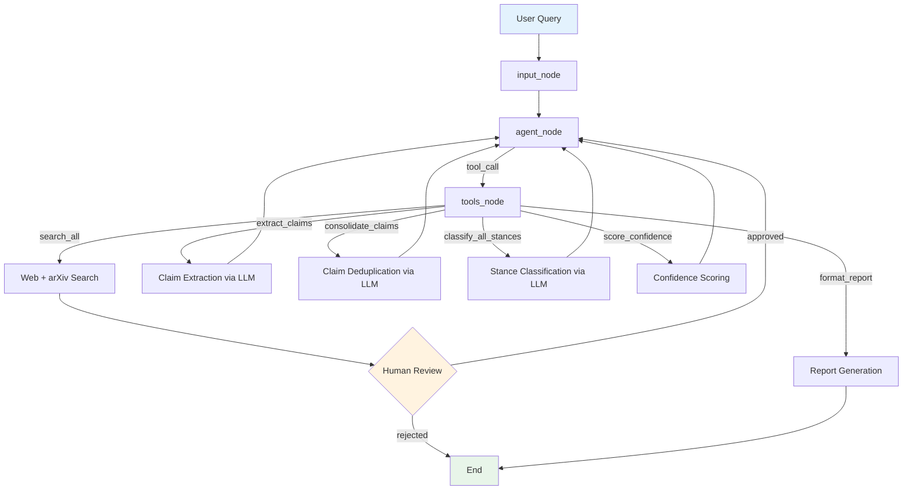

# Basic Confidence Scorer

A simple terminal-based confidence scorer app. It is meant as a small learning project to show how a local Python CLI can call an LLM service, gather evidence, and estimate confidence for an assertion.

## What this does

- Runs from the command line
- Uses a local LLM backend for text understanding
- Produces a basic confidence-style score for a query
- Keeps the setup intentionally small and easy to follow

## Agent flow



## Tech stack

| Layer | Tool | What it does |
|-------|------|--------------|
| Orchestration | [LangGraph](https://langchain-ai.github.io/langgraph/) | Runs the agent as a state machine. Each pipeline stage is a node, edges route between them, and a checkpointer enables human review pauses. See [`orchestrator.py`](confidence_scorer/agent/orchestrator.py). |
| LLM Gateway | [LiteLLM](https://docs.litellm.ai/) | Single interface to any LLM provider. Switch from Ollama to OpenAI by changing one env var. See [`gateway.py`](confidence_scorer/llm/gateway.py). |
| Structured Output | [Pydantic](https://docs.pydantic.dev/) | Every LLM response is validated into typed models (`RawClaim`, `CanonicalClaim`, `StanceResult`) instead of raw strings. See [`state.py`](confidence_scorer/agent/state.py). |
| Evidence Gathering | [DuckDuckGo](https://pypi.org/project/ddgs/) / [Tavily](https://tavily.com/) / [arXiv API](https://pypi.org/project/arxiv/) | Web and academic search tools that return real sources so the LLM scores claims against evidence, not its own training data. See [`tools/`](confidence_scorer/tools/). |
| State Management | [LangChain Core](https://python.langchain.com/docs/get_started/introduction) | Provides message types (`HumanMessage`, `AIMessage`, `ToolMessage`) and the `add_messages` reducer that keeps conversation history consistent across nodes. See [`nodes.py`](confidence_scorer/agent/nodes.py). |
| CLI and Infra | [Python 3.10+](https://www.python.org/) / [uv](https://docs.astral.sh/uv/) / [Rich](https://rich.readthedocs.io/) | `uv` handles dependency management, `Rich` formats terminal output. See [`cli.py`](confidence_scorer/cli.py). |

## Learnings

1. **The agent is a state machine, not a chatbot.** LangGraph enforces a fixed pipeline (search, extract, consolidate, classify, score, report) where each node reads from and writes to a typed [`AgentState`](confidence_scorer/agent/state.py). The graph controls flow, not the model. The model only does text understanding within each node.

2. **Tool use separates reasoning from execution.** The [`agent_node`](confidence_scorer/agent/nodes.py) emits a `tool_call` message. The [`tools_node`](confidence_scorer/agent/nodes.py) dispatches it, runs deterministic Python, and returns a `ToolMessage`. The LLM handles extraction and classification. Search, scoring, and formatting are plain functions.

3. **Structured output removes all parsing logic.** The [`gateway.structured()`](confidence_scorer/llm/gateway.py) method passes a Pydantic model as `response_format` to the LLM. The response comes back validated. If validation fails, the call retries automatically. No regex, no manual JSON parsing.

4. **Human review is a first class graph feature.** LangGraph's `interrupt()` pauses the graph at [`human_node`](confidence_scorer/agent/nodes.py), serialises state to the checkpointer, and resumes exactly where it stopped after user input. The user sees all sources before analysis proceeds.

## Key things to remember

1. [`AgentState`](confidence_scorer/agent/state.py) is the single source of truth. Every node reads from it and returns a partial update dict. To add a new pipeline stage, add a field to `AgentState` and a new stage number in [`detect_stage()`](confidence_scorer/agent/nodes.py).

2. [`LLMGateway`](confidence_scorer/llm/gateway.py) wraps LiteLLM directly, not LangChain's chat models. This gives full control over retries, structured output, and tool formatting without extra abstraction.

3. All search tools return a common [`Source`](confidence_scorer/tools/base.py) dataclass. Adding a new provider means writing one class with a `.search()` method that returns `list[Source]`.

## Requirements

- Python 3.10 or newer
- `uv` installed (`pip install uv` or follow https://docs.astral.sh/uv/)
- `Ollama` installed and running locally
- A pulled model for Ollama, for example:

```bash
ollama pull llama3.2
```

## Configuration

1. Copy the example environment file:

```bash
cp .env.example .env
```

2. Open `.env` and set these values:

- `OLLAMA_BASE_URL` – the local URL for your Ollama server, for example `http://127.0.0.1:11434`
- `LLM_MODEL` – the model name you want to use with Ollama
- `WEB_SEARCH_PROVIDER` – optional, defaults to `duckduckgo`
- `TAVILY_API_KEY` – optional, only needed if using `tavily`

> `OLLAMA_BASE_URL` is the address where the local model server is reachable.
> `TAVILY_API_KEY` is only required when using Tavily search; DuckDuckGo does not need a key.

## Setup

```bash
uv sync
source .venv/bin/activate
```

If `uv sync` creates a `.venv`, the `source` command activates the virtual environment.

## Running locally

Use the provided CLI entrypoint. For example:

```bash
python -m confidence_scorer.cli "Is regular exercise linked to better memory?"
```

If the repository installs a script entrypoint, you can also run:

```bash
uv run confidence_scorer "Is regular exercise linked to better memory?"
```

## Optional search provider

The project can use DuckDuckGo without extra setup.

To enable Tavily search instead:

1. Set `WEB_SEARCH_PROVIDER=tavily` in `.env`
2. Add `TAVILY_API_KEY=<your-key>` to `.env`

## Tests

Run the test suite with:

```bash
uv run pytest
```

## Notes

This is a minimal, experimental repository for exploring confidence scoring with a local LLM service. It is not a production system.

## License

MIT
